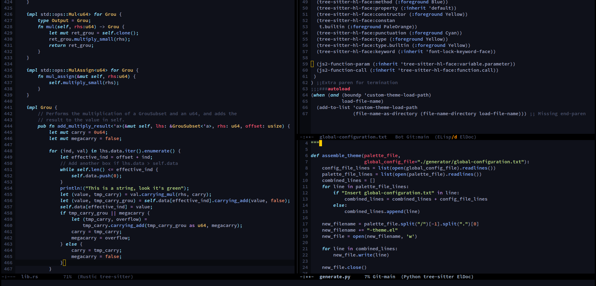

A port of the VSCode Community Material themes. 

This adds the very nice oceanic and palenight themes to emacs, featuring a dark and darker background.

* `material-ocean`
* `material-ocean-dark`
* `material-palenight`
* `material-palenight-dark`

See a comparison of the four themes [here](/comparison-screenshots/comparison.md)

This package starts from a base of nothing, so may not include all faces, if you see something that clashes, please make an issue so that I can add them.

# Screenshots!



Screenshots are using `tree-sitter-hl-mode` (from `tree-sitter-langs`), the font is Source Code Pro Semibold.

# Installation

Prerequisite is `autothemer`. Install it from MELPA with `M-x package-refresh-contents RET` then `M-x package-install RET autothemer`.

Since these themes are still in development, they are not yet available on MELPA. As such the configuration has a few extra steps.

First, clone the git repo. Alternatively, download the zip file by going to the top of this page and selecting "Download zip" from the "Code" dropdown menu, and extract the contents.

You then need to add the folder to `custom-themes-load-path`. This can be done by adding the following line to your `.emacs` file.

```
(push "/path/to/directory/folder/emacs-material-ocean/" custom-theme-load-path)
(push "/path/to/directory/folder/emacs-material-ocean/" load-path)
```

Then, right below that, add the following line to load the theme.
```
(load-theme 'material-ocean t)
```

# Supported modes

Let me know if you'd like me to add your favorite mode! (Simply file an issue)

* tree-sitter-hl-mode
* magit-mode
* diff/ediff
* eshell
* org-mode
* slime
* sly

# Notes

See the original pallettes [here](https://github.com/material-theme/vsc-material-theme/blob/a0079e8d0cc8711cd81d410827fcc16bcb1f9e6b/scripts/generator/settings/specific/ocean-hc.ts)

It's made with [autothemer](https://github.com/jasonm23/autothemer), with some use of tools like Paletton and [fontify-face](https://github.com/Fuco1/fontify-face).

